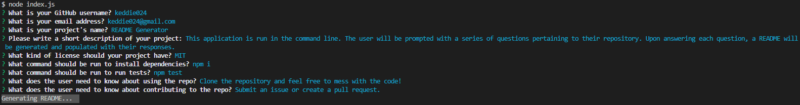

# readme_generator

## 4/16/21

This application is run in the command line. The user will be prompted with a series of questions pertaining to their repository. Upon answering each question, a README will be generated and populated with their responses.

## Link to Video Walkthrough

https://drive.google.com/file/d/1pxSR1YIXeErpXql35VGypDIjUM-MFAUF/view

## Image of Application

